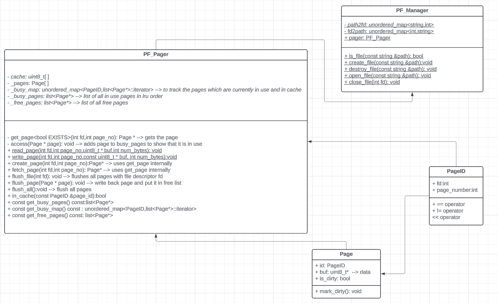

# Page File Manager System Documentation

## Overview

This module implements a basic page file management system, including:

* **`PF_Pager`**: Handles in-memory page caching and I/O operations to/from disk.
* **`PF_Manager`**: Manages file-level operations like creating, opening, closing, and deleting files, and interfaces with the pager.

This system is designed to optimize page-based access to files using a limited-size memory cache (LRU policy).

---

## `PF_Pager` Class

### Description

`PF_Pager` manages a fixed-size in-memory cache of pages read from or written to disk. It implements an **LRU (Least Recently Used)** replacement strategy when the cache is full.

### Data Members

* `uint8_t _cache[NUM_CACHE_PAGES * PAGE_SIZE]`: Raw memory buffer to hold all page data.
* `Page _pages[NUM_CACHE_PAGES]`: Array of Page objects representing metadata and buffers.
* `std::list<Page *> _busy_pages`: Pages currently in use (i.e., in cache).
* `std::unordered_map<PageID, std::list<Page *>::iterator> _busy_map`: Map of page ID to its position in `_busy_pages`.
* `std::list<Page *> _free_pages`: Pages available for reuse (not in cache).

---

### Public Functions

#### `PF_Pager()`

Initializes the cache. Links the `_pages` to their respective buffer offsets and adds all pages to `_free_pages`.

#### `~PF_Pager()`

Flushes all dirty pages to disk. Asserts that all pages are freed back to `_free_pages`.

#### `Page *create_page(int fd, int page_no)`

* Allocates and returns a new page in cache.
* Marks the page as dirty.
* Does **not** load content from disk (assumes a new page).

#### `Page *fetch_page(int fd, int page_no)`

* Retrieves an existing page from disk.
* If the page is in cache, it is moved to the front (most recently used).
* If not in cache, a page is evicted and the requested page is read into memory.

#### `void flush_file(int fd)`

* Iterates over all busy pages and flushes those associated with the given file descriptor.

#### `void flush_page(Page *page)`

* Forces a dirty page to be written to disk.
* Removes it from `_busy_pages` and adds it to `_free_pages`.

#### `void flush_all()`

* Flushes all dirty pages to disk and clears the cache (`_busy_pages`).

#### `bool in_cache(const PageID &page_id) const`

* Returns true if a page is in cache (`_busy_map`).

#### Accessor Functions

* `get_busy_pages()`: Returns list of busy pages.
* `get_busy_map()`: Returns the map of cached page positions.
* `get_free_pages()`: Returns list of free pages.

---

### Static Helper Functions

#### `static void read_page(int fd, int page_no, uint8_t *buf, int num_bytes)`

* Reads `num_bytes` from the given file descriptor and page number into `buf`.

#### `static void write_page(int fd, int page_no, const uint8_t *buf, int num_bytes)`

* Writes `num_bytes` from `buf` to the file at the specified page location.

---

### Private Functions

#### `template <bool EXISTS> Page *get_page(int fd, int page_no)`

* Core page access function.
* If `EXISTS == true`, assumes the page exists on disk and loads it.
* If `EXISTS == false`, assumes it’s a new page.
* Handles LRU eviction if cache is full:

  * Removes least recently used page from back of `_busy_pages`.
  * Writes dirty page back to disk.
* Moves accessed page to the front of `_busy_pages`.

#### `void force_page(Page *page)`

* If the page is dirty, writes it to disk and marks it clean.

#### `void access(Page *page)`

* Moves the page to the front of `_busy_pages` (marks it as most recently used).

---

## `PF_Manager` Class

### Description

`PF_Manager` is responsible for file-level operations and tracking open files.

### Static Members

* `static PF_Pager pager`: Global pager instance used for page caching.
* `static std::unordered_map<std::string, int> _path2fd`: Maps file path to file descriptor.
* `static std::unordered_map<int, std::string> _fd2path`: Maps file descriptor back to file path.

---

### Functions

#### `static bool is_file(const std::string &path)`

* Checks if the file exists and is a regular file using `stat`.

#### `static void create_file(const std::string &path)`

* Creates a new file with user read/write permissions.
* Throws `FileExistsError` if the file already exists.

#### `static void destroy_file(const std::string &path)`

* Deletes a file.
* Throws `FileNotFoundError` if the file doesn’t exist.
* Throws `FileNotClosedError` if file is still open.

#### `static int open_file(const std::string &path)`

* Opens an existing file in read/write mode.
* Throws:

  * `FileNotFoundError` if the file doesn’t exist.
  * `FileNotClosedError` if already open.
* Registers the open file in `_path2fd` and `_fd2path`.

#### `static void close_file(int fd)`

* Closes the file descriptor.
* Flushes associated pages from cache via `pager.flush_file`.
* Unregisters the file descriptor from internal maps.

---

## Page Eviction Algorithm: LRU

1. Pages in `_busy_pages` are maintained in usage order.
2. Most recently accessed pages are at the **front**, least recently used at the **back**.
3. When cache is full:

   * Evict the page at the back of `_busy_pages`.
   * Flush it to disk if dirty.
   * Remove it from `_busy_map`.
   * Reuse it for the new page.

---

## Error Handling

The module throws appropriate exceptions (assumed to be defined in `error.h`) like:

* `FileNotFoundError`
* `FileExistsError`
* `FileNotClosedError`
* `FileNotOpenError`
* `UnixError`

These errors ensure safe and predictable behavior for file and memory management.

---

