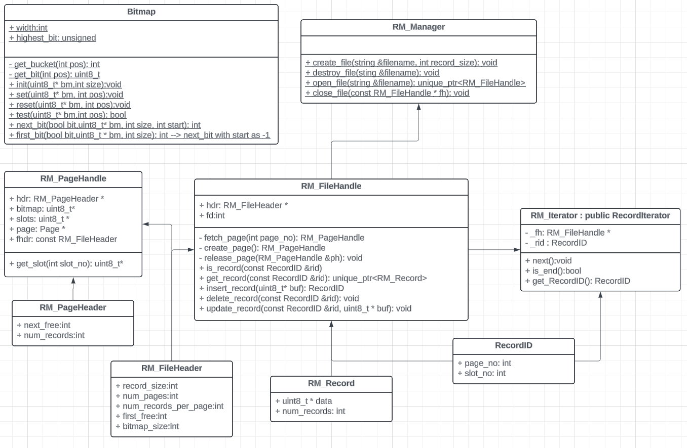

# Record Management System Documentation

## Overview

This module is part of a database system that implements record-level management using fixed-size pages, bitmaps for slot management, and a structured interface for accessing and manipulating records. The key components are:

* **`RM_FileHandle`**: Manages a single record-based file.
* **`RM_Manager`**: Interfaces with the file system to create, open, destroy, or close record files.
* **`RM_Iterator`**: Allows iteration over all valid records.
* **`RM_PageHandle`**: Represents a view of a page, providing access to metadata, bitmap, and record slots.
* **`RM_Record`**: Represents an individual record with associated data and size.
* **`Bitmap`**: Utility class for efficient bit-level tracking of usage/free status across an array, often used to track page allocation.

---

## Constants and Structures (`rm_defs.h`)

### Structures

#### `RM_FileHeader`

Contains metadata about the record file:

* `int record_size`: Size of each record.
* `int num_pages`: Total number of pages in the file.
* `int num_records_per_page`: Number of records that can fit in a page.
* `int first_free`: Page number of the first free page (linked list).
* `int bitmap_size`: Number of bytes used for the slot bitmap in each page.

#### `RM_PageHeader`

Metadata per page:

* `int next_free`: Next page in the free list.
* `int num_records`: Number of occupied records in this page.

#### `RM_Record`

Represents an in-memory record:

* `uint8_t *data`: Pointer to the record’s data buffer.
* `int size`: Size of the record.

##### Constructor/Destructor:

* `RM_Record(int size_)`: Allocates `size_` bytes of memory.
* `~RM_Record()`: Cleans up allocated memory.

##### Deleted Methods:

* Copy constructor and assignment operator are deleted to prevent unintended copying.

---

## `Bitmap` Class

### Description

`Bitmap` is a static utility class for efficiently managing a bitmap stored in memory, where each bit represents the availability (used/free) of a slot (e.g., page). It is especially useful in memory managers, file systems, or buffer managers.

### Functions

#### `static void init(uint8_t *bm, int size)`

Initializes a bitmap of given size by setting all bits to 0 (free).

#### `static void set(uint8_t *bm, int pos)`

Marks the bit at position `pos` as used (sets it to 1).

#### `static void reset(uint8_t *bm, int pos)`

Marks the bit at position `pos` as free (sets it to 0).

#### `static bool test(const uint8_t *bm, int pos)`

Returns true if the bit at position `pos` is set (i.e., used).

#### `static int next_bit(bool bit, const uint8_t *bm, int size, int start)`

Searches from position `start + 1` to `size - 1` for the first bit matching `bit`. Returns index or `size` if not found.

#### `static int first_bit(bool bit, const uint8_t *bm, int max_n)`

Returns the index of the first bit set to `bit` from the start of the bitmap.

### Internal Helpers

* `get_bucket(int pos)`: Returns the index of the byte containing the bit at position `pos`.
* `get_bit(int pos)`: Returns a mask to isolate the bit within the byte corresponding to position `pos`.

---

## `RM_FileHandle` Class

### Description

`RM_FileHandle` provides the primary interface for interacting with a record file. It uses the `PF_Pager` layer for page management and the `Bitmap` class for slot tracking within each page.

### Members

* `RM_FileHeader hdr`: Contains metadata like record size, total pages, first free page, etc.
* `int fd`: File descriptor obtained from `PF_Manager`.

### Core Functions

#### `RM_FileHandle(int fd_)`

* Loads the file header from disk.

#### `bool is_record(const RecordID &rid) const`

* Checks if a record exists at the given `RecordID` using the bitmap.

#### `std::unique_ptr<RM_Record> get_record(const RecordID &rid) const`

* Fetches the record data into a heap-allocated `RM_Record`.
* Throws `RecordNotFoundError` if the slot is unused.

#### `RecordID insert_record(uint8_t *buf)`

* Finds or creates a page with free space.
* Sets the corresponding bitmap.
* Increments the `num_records` in the page.
* Copies the buffer to the appropriate slot and returns the `RecordID`.

#### `void delete_record(const RecordID &rid)`

* Marks the bitmap slot as free.
* Decrements `num_records`.
* Adds the page to the free list if it was full before deletion.

#### `void update_record(const RecordID &rid, uint8_t *buf)`

* Overwrites the existing record with the new buffer.
* Throws if the record does not exist.

---

## `RM_PageHandle` Struct

### Description

Encapsulates the layout and access mechanisms of a record page.

### Members

* `RM_PageHeader *hdr`: Pointer to the page header.
* `uint8_t *bitmap`: Start of the bitmap region.
* `uint8_t *slots`: Beginning of the record slots.
* `Page *page`: The raw page pointer.
* `const RM_FileHeader *fhdr`: Metadata from the file header.

### Constructor

* Initializes pointers based on page buffer layout.

### Methods

#### `uint8_t *get_slot(int slot_no) const`

* Returns a pointer to the beginning of a slot’s data.

---

## `RM_Iterator` Class

### Description

Used to iterate through all existing records in a file.

### Members

* `const RM_FileHandle *_fh`: Pointer to file handle.
* `RecordID _rid`: Current record identifier.

### Methods

#### `RM_Iterator(const RM_FileHandle *fh)`

* Starts iteration at first record page and searches for the first occupied slot.

#### `void next()`

* Advances `_rid` to the next occupied slot.
* Sets `_rid.page_no = RM_NO_PAGE` if iteration is complete.

#### `bool is_end() const`

* Returns true if no more records are available.

#### `RecordID get_RecordID() const`

* Returns the current record ID.

---

## `RM_Manager` Class

### Description

Handles creation, destruction, opening, and closing of record files.

### Static Methods

#### `void create_file(const std::string &filename, int record_size)`

* Verifies the record size is valid.
* Computes:

  * `num_records_per_page` = max number of records that can fit with header + bitmap + records ≤ page size.
  * `bitmap_size` = bytes needed to store bitmap.
* Writes file header to the first page.

#### `void destroy_file(const std::string &filename)`

* Deletes the file using `PF_Manager`.

#### `std::unique_ptr<RM_FileHandle> open_file(const std::string &filename)`

* Opens file and initializes a new `RM_FileHandle`.

#### `void close_file(const RM_FileHandle *fh)`

* Writes back file header to disk.
* Closes the file using `PF_Manager`.

---

## Page and Slot Management Algorithm

1. **Insertion**

   * If no free page, create one.
   * Find the first free slot using `Bitmap::first_bit(false, ...)`.
   * Mark it used, copy record, and return `RecordID`.

2. **Deletion**

   * Verify record exists using bitmap.
   * Mark slot as free.
   * If page was full, update free list.

3. **Iteration**

   * Search through each page, checking bitmap for next used slot.

---

## Error Handling

Uses exceptions (likely defined in `rm_defs.h`) such as:

* `InvalidRecordSizeError`
* `RecordNotFoundError`

These ensure operations fail gracefully when invalid states are encountered.

---

